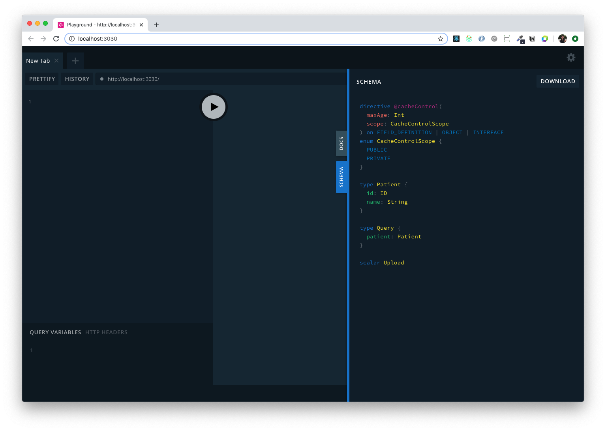
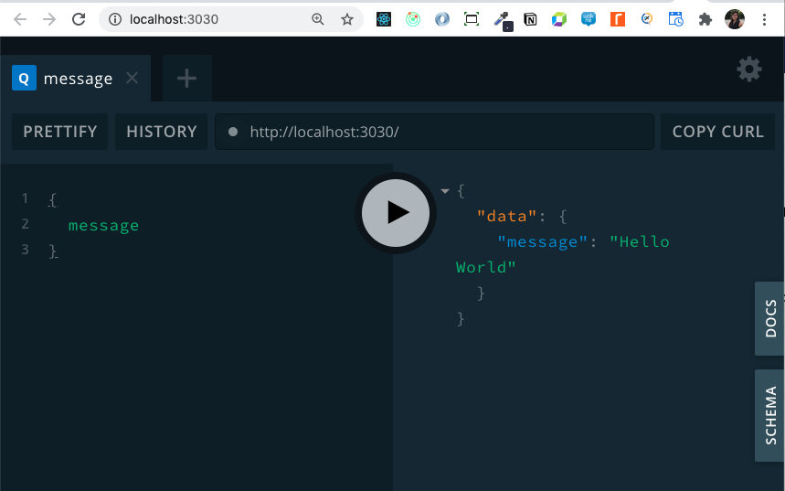

# GraphQL Exercises

## Goal

Build an API to:

- Using a patient's ID, get a patient's details for: name and list of doctors they have seen
- Using a doctor's ID, get a doctor's details: name and list of patients they have seen
- Create an appointment

## Final Result

The final result is hosted on PCF: [https://instructor-graphql.apps.cac.preview.pcf.manulife.com/](https://instructor-graphql.apps.cac.preview.pcf.manulife.com/)

## How to use this README

There are exercises with step-by-step instructions and code snippets to work through. These are also accompanied by folders for each exercise with the final code.

You are encouraged to try and solve each exercise by yourself by reading the goal and outcome, however the written instructions are there to guide you if you get lost!

Create your own folder to follow along with the exercises. If you need to consult the final code for that exercise, navigate to the appropriate folder. For each folder, you can also run `npm install` then `npm start` to test out the final outcome for that exercise.

Exercises:

- [Setup](#setup)
- [Exercise 1: Hello World](#hello-world)
- [Exercise 2: Query patient by id](#query-patient-by-id)
- [Exercise 3: Query a patient's list of doctors](#query-a-patients-list-of-doctors)
- [Exercise 4: Query doctor by id + query a doctor's list of patients](#query-a-doctor-by-id-and-a-doctors-list-of-patients)
- [Exercise 5: Mutations](#mutations)
- [Exercise 6: Performance Optimization with DataLoader](#performance-optimization-with-dataloader)
- [Exercise 7: PCF Deploy](#deploying-to-pcf)
- [Bonus Challenges](#bonus-challenges)

## Setup

1. Create a directory `mkdir <lan-id>-graphql`.

1. Navigate to the directory `cd <lan-id>-graphql`.

1. Open it up in VS Code.

1. Run `npm init -y` to initialize your Node application.

1. Install the following packages:

   - [graphql](https://www.npmjs.com/package/graphql) - the JavaScript reference implementation for GraphQL
   - [apollo-server](https://www.npmjs.com/package/apollo-server) - community-maintained open-source GraphQL server that makes it easy for us to create our GraphQL API
   - [nodemon](https://www.npmjs.com/package/nodemon) - Automatically restarts the node application when file changes in the directory are detected. Useful when coding.

   ```bash
   npm i graphql apollo-server nodemon
   ```

   Note that this may take a few minutes! If there are issues, make sure an `.npmrc` file was added correctly.

## Hello World

**Goal**: Get a simple Hello World example running on GraphQL Playground. You should be able to query `{ message }` that returns a string saying "Hello World".

1. Add 2 scripts in your `package.json`.

   ```json
   "start": "node .",
   "start:dev": "nodemon .",
   ```

   To run your application, run `npm start`. To run in development mode where new changes to your code will automatically restart the server, run `npm run start:dev`. Running either of this will fail right now since we don't have an `index.js` (starting point) yet.

1. Create a new file called `index.js`. Note that we will be using plain JavaScript here so we don't have to worry about connecting Babel and transpiling our code, so the syntax here may be different from what has been shown in MU so far.

   ```js
   const { ApolloServer } = require('apollo-server');
   const { PORT = 3030 } = process.env;

   const server = new ApolloServer();

   server
     .listen(PORT)
     .then(({ url }) => console.log(`🚀 Server running at ${url}`));
   ```

   - We're using `const X = require('Y')` here instead of the ES6 `import X from 'Y'`. Learn more [here](https://www.geeksforgeeks.org/difference-between-node-js-require-and-es6-import-and-export/).

   - We need to destructure `ApolloServer` here (curly braces are needed) because it is a named export from the `apollo-server` module. Learn more about [default vs named exports here](https://developer.mozilla.org/en-US/docs/web/javascript/reference/statements/export).

   - To start the server, use the `ApolloServer.listen` function. [Documentation for ApolloServer.listen()](https://www.apollographql.com/docs/apollo-server/api/apollo-server/#apolloserverlisten). The function returns a promise that has a `url` parameter we can use.

1. When you run your app with `npm run start:dev`, you will get errors, and this is because `ApolloServer` needs [options](https://www.apollographql.com/docs/apollo-server/api/apollo-server/), as per the documentation. It needs 2 parameters: your schema definition and your set of resolvers. Let's set those up next.

### Adding the Schema

1. Create a file called `typeDefs.js`. This will contain all of our schema's type definitions.

   ```js
   const { gql } = require('apollo-server');

   const typeDefs = gql`
     type Query {
       message: String
     }
   `;

   module.exports = typeDefs;
   ```

   - Learn more about the `gql` [tag here](https://www.apollographql.com/docs/apollo-server/api/apollo-server/#gql).

   - We are defining our **Type Definitions or Schema** in this file. It describes the shape of our data graph. It specifies what queries and mutations and the shapes of those. Learn more from the [GraphQL Documentation here](https://www.apollographql.com/docs/apollo-server/schema/schema/).

   - There are [5 different categories for types](https://www.apollographql.com/docs/apollo-server/schema/schema/#supported-types): Scalar, Object, `Query`, `Mutation` and Input types.

   - The Query type defines exactly which GraphQL queries (i.e., read operations) clients can execute against your data graph. We're doing a simple "Hello World" example, so we'll define a `message` field with a `String` type.

   - Note that we are using a [default export](https://developer.mozilla.org/en-US/docs/web/javascript/reference/statements/export) here.

1. Hook up the `typeDefs` to your Apollo server. In index.js, import the `typeDefs` module. Add it to your `ApolloServer` options.

   ```js
   const typeDefs = require('./typeDefs');

   const server = new ApolloServer({ typeDefs });
   ```

   - ApolloServer is expecting an `options` object with a property called `typeDefs`. The long-hand way of writing the above line would be:

   ```js
   const server = new ApolloServer({ typeDefs: typeDefs });
   ```

   - Learn more about [object notation shorthand here](https://alligator.io/js/object-property-shorthand-es6/).

1. Your server should be running with no errors now. Go to the URL in your browser. You should see the GraphQL Playground.




1. Check out the Schema + Docs tab.

   The Docts tab lets developers explore the schema and type definitions you defined in `typeDefs.js` so that they know what they can query and how. It includes comments you defined and detailed explanations of each type.

   The Schema tab is the `typeDefs.js` file excluding comments.

1. You can add comments as documentation in your types.

   ```
   type Query {
     """
     A Hello World example
     """
      message: String
    }
   ```

   This description shows up in the Schema tab.

1. Finally, let's write a query for the message on the left-hand side of GraphQL Playground. Press the play button to run the query.

   ```
   query {
     message
   }
   ```

1. This will give us `null` because we don't have any resolvers yet. Let's set those up next.

### Adding Resolvers

We've defined the start of our schema, but Apollo Server doesn't know what to return when it's executing a query. To fix this, we create a resolver.

**A resolver is a function that's responsible for populating the data for a single field in your schema**.

1. Create a file called `resolvers.js`.

1. In `resolvers.js`, add a resolver for the top-level `Query` and the field `message`.

   Note that we're following the same structure as the type definitions.

   A resolver takes in 4 arguments. You can find more information in the [documentation here](https://www.apollographql.com/docs/apollo-server/data/resolvers/#resolver-arguments). We'll explain more about each as we use them.

   ```js
   const Query = {
     message: (parent, args, context, info) => {
       // note the arrow-function syntax here
       return 'Hello World';
     },
   };

   module.exports = { Query }; // we'll add more resolvers to this object
   ```

1. Hook up the resolvers to the `ApolloServer` in the options. In `index.js`:

   ```js
   const resolvers = require('./resolvers');
   // `resolvers` here is set to { Query }, the object we exported from `resolvers.js` previously

   const server = new ApolloServer({ typeDefs, resolvers });
   ```

   - Again, we're using the shorthand object notation here to add another option property for `resolvers`.

1. Run the query again in GraphQL Playground and you should get back your "Hello World" message.

   

   Query

   ```graphql
   query {
     message
   }
   ```

   Response

   ```json
   {
     "data": {
       "message": "Hello World"
     }
   }
   ```

   Note the way the response mirrors the query. This will become more evident in the next few examples.

## Query patient by id

**Goal**: Query a patient by their ID using the REST APIs provided here: [https://rest-example-node.apps.cac.preview.pcf.manulife.com/docs](https://rest-example-node.apps.cac.preview.pcf.manulife.com/docs)

You should be able to run the query below and get the correct data:

```graphql
query {
  patient(id: "1") {
    name
    id
  }
}
```

1. Now that we have a simple Hello World up and running, let's try to get a patient by id.

   First, we need to add a `Patient` type to our schema. In `typeDefs.js`, add a patient to the top-level query, and a Patient type. Feel free to remove the simple "Hello World" example code.

   The `patient` query takes in an `id` argument with type `ID`. It returns an object of type `Patient`.

   The exclamation mark after `ID` means that is a required argument. When a client queries for `patient`, they _must_ include an id to query for. [More information on arguments here.](https://graphql.org/learn/schema/#arguments)

   ```js
   const typeDefs = gql`
     type Query {
       patient(id: ID!): Patient
     }

     type Patient {
       id: ID
       name: String
     }
   `;
   ```

1. After defining the query and type, a resolver needs to be added to return the necessary information.

   Following the structure of the schema, we add a `patient` resolver under `Query`.Then our resolver should be able to access the id.

   ```js
   const Query = {
     patient: (parent, args, context, info) => {},
   };
   ```

1. Let's return a hard-coded patient for now. A `patient` is an object with an id and name, so that's what we'll return.

   ```js
   const Query = {
     patient: (parent, args, context, info) => {
       return {
         id: '5',
         name: 'Sanjay Dutt',
       };
     },
   };
   ```

1. Let's test this query in the GraphQL Playground to check if we're getting a hard-coded patient back.

   ```graphql
   query {
     patient(id: "1") {
       name
       id
     }
   }
   ```

   The structure is the same as the schema. You can also use `Ctrl+Space` in the GraphQL Playground to bring up a list of possible fields you can query.

   Try the query with no `id` argument. Note the red block beside the line denoting an error and hover over to see the error. Try running the query with the error and read the error that pops up.

   If you don't specify a required argument, you get a message similar to:

   ```
   Field \"patient\" argument \"id\" of type \"ID!\" is required, but it was not provided."
   ```

   This lets you know exactly what you need to fix!

1. Now let's go one step further and try to return the id that was provided in the query arguments.

   The resolver can access the id paramater through `args` (the arguments that were given to the query).

   ```js
   const Query = {
     patient: (parent, args, context, info) => {
       const { id } = args; // JS object destructuring
       return {
         id: id, // note that this can be shortened to just `id`
         name: 'Sanjay Dutt',
       };
     },
   };
   ```

   - Learn more about [destructuring here](https://developer.mozilla.org/en-US/docs/Web/JavaScript/Reference/Operators/Destructuring_assignment)

1. Let's test it out! In GraphQL Playground, change your query to look like:

   ```graphql
   query {
     patient(id: "1") {
       name
       id
     }
   }
   ```

   The response should give you the `id` back, but still with the hard-coded name. Test it out with different ids.

   The next step is to get dynamic data.

1. Install `node-fetch` by running `npm i node-fetch`. We'll be using this package to help us make HTTP calls to our REST API.

1. In `resolvers.js`, import the `fetch` module.

   ```js
   const fetch = require('node-fetch');
   ```

1. In the MU REST API course, you built a REST API for doctors, patients and visits. We'll be using a coach-provided API for our REST calls that is very similar to that API. The [API documentation can be found here](https://rest-example-node.apps.cac.preview.pcf.manulife.com/docs/?url=%2Fapi-docs#/).

   Note that you can use your own version of the API if you've deployed it successfully to PCF - however, we recommend using the coach-provided API for this exercise to avoid errors in minor differences between both.

   Add this as a base URL in `resolvers.js`.

   ```js
   const API_URL =
     'https://rest-example-node.apps.cac.preview.pcf.manulife.com/v1';
   ```

1. Next, we want to call our API with that ID. You can test out the REST API call using the [Swagger UI](https://rest-example-node.apps.cac.preview.pcf.manulife.com/docs/?url=/api-docs#!/patient/getPatient) to understand how the call will be shaped and what the response will look like. Your resolver should now look like this:

   ```js
   const API_URL =
     'https://rest-example-node.apps.cac.preview.pcf.manulife.com/v1';

   const Query = {
     patient: async (parent, args, context, info) => {
       const { id } = args;
       const response = await fetch(`${API_URL}/patient/${id}`);
       const result = await response.json();
       return result;
     },
   };
   ```

   For more information on how to use `fetch`, [check the documentation](https://developer.mozilla.org/en-US/docs/Web/API/Fetch_API/Using_Fetch). The `fetch` call returns the HTTP response. We need to exrtract the JSON body content from that response using `response.json()`. From there, we get our patient information!

   Note that we are returning the entire response body, which may be more than what the GraphQL query is expecting. GraphQL is filtering out the properties that were asked for. There are pros and cons to this approach.

   - Through the MU Modern JavaScript course, you should be familiar with `async/await` and `Promises`.

1. Now when you run the query in GraphQL Playground, it should give you dynamic responses based on the REST API data!

   ```graphql
   query {
     patient(id: "2") {
       id
       name
     }
   }
   ```

## Query a patient's list of doctors

**Goal**: Query a patient's list of doctors using the REST APIs here: [https://rest-example-node.apps.cac.preview.pcf.manulife.com/docs](https://rest-example-node.apps.cac.preview.pcf.manulife.com/docs). Specifically, visits and doctors endpoints.

You should be able to run the query below and get the correct data:

```graphql
query {
  patient(id: "1") {
    name
    id
    doctors {
      name
      id
    }
  }
}
```

1. First, let's add a `Doctor` type to our schema. In `typeDefs.js`, add:

   ```graphql
   type Doctor {
     id: ID
     name: String
   }
   ```

1. We also need to update the Patient type to be have a field that returns a list/array of doctors.

   ```graphql
   type Patient {
     id: ID
     name: String
     doctors: [Doctor]
   }
   ```

1. You can try the query now, but the `doctors` field will return `null`! That's because we haven't added a resolver yet.

   Where should the resolver for a patient's doctors go?

   To answer this in more detail, take a look at [how resolver chains](https://www.apollographql.com/docs/apollo-server/data/resolvers/#resolver-chains) and [default resolvers](https://www.apollographql.com/docs/apollo-server/data/resolvers/#default-resolvers) work.

   In the previous example, we were accessing `patient` as a top-level query. Now we want to access the `doctors` field from the `Patient` type. So we'll structure the resolver to mirror that.

   In `resolvers.js`, we'll define a resolver for `Patient` and add a resolver for `doctors` under that.

   ```js
   const Query = { ... };

   const Patient = {
     doctors(parent, args, context, info) {
       // note the basic function syntax here instead of arrow function!

       // Return a hard-coded array for now to test!
      return [
        {id: "1", name: "Doctor Who"},
        {id: "2", name: "Dr Pepper"}
      ]
     },
   };

   module.exports = {
       Query,
       Patient
   };
   ```

1. Test the query in GraphQL Playground to see the hard-coded list of doctors for any patient. It's very helpful to implement in small steps like this and test as you go!

1. Let's replace the hard-coded data with real data! Using our REST API, we want to use the `/visit` endpoint to get a list of doctors that the patient has seen. We want to use the `/visit/patient/:patientId` endpoint specifically. [See the Swagger documentation here](https://rest-example-node.apps.cac.preview.pcf.manulife.com/docs/?url=/api-docs#!/visit/getPatientVisits).

   In the previous example for retrieving a patient by id, we accessed the `id` through `args`.

   For this example, how do we get the patient id from the `doctors` resolver? `args` does not contain it (otherwise, the query would look something like `doctors(id: ID!)`).

   To get the `:patientId` value, we actually want to access this from the `parent` argument. How does this work, what is `parent`? It goes back to [resolver chains](https://www.apollographql.com/docs/apollo-server/data/resolvers/#resolver-chains).

   The resolver chain looks something like this:

   ```
   Query.patient() -> Patient.doctors() -> Doctor
   ```

   The first resolver has access to `id` through the query arguments (`args`).

   Therefore, the second resolver can access that same id through `parent`! Parent in this case refers to `Query.patient`.

   In `resolvers.js`, let's access that id and do the `fetch` call to get all the visits that patient has.

   ```js
   const Patient = {
     async doctors(parent, args, context, info) {
       const { id } = parent;
       const url = `${API_URL}/visit/patient/${id}`;

       const visits = await fetch(url).then((res) => res.json());

       // Equivalent to
       // const result = await fetch(url);
       // const visits = await result.json();

       console.log(visits);
     },
   };
   ```

   Try running the query in GraphQL playground again.

   You should see in the server console (not the browser!), the array of visits for that patient. Each visit has `doctor_id`, `patient_id` and `completed` properties.

   Note the difference in our API call here! In the previous example, we used only `async/await`, now we're adding a `.then` since `fetch` returns a Promise. But it is equivalent to having 2 `await` lines!

1. Now that we have the list of visits, we want to iterate through that list and grab the doctor information (id and name), since we only have the id. More details in the comments below.

   ```js
   const Patient = {
     async doctors(parent, args, context, info) {
       const { id } = parent;
       const url = `${API_URL}/visit/patient/${id}`;

       const visits = await fetch(url).then((res) => res.json());
       console.log(visits); // observe the shape of the return value

       // GOAL: we want to iterate through the list of visits and use the `doctor_id` to do a
       //  GET /doctors/doctor_id call, and build our array of doctors that the patient has seen

       // since this fetch returns a promise, we end up with an array of Doctor Promises.
       const arrayOfDoctorPromises = visits.map((v) =>
         fetch(`${API_URL}/doctor/${v.doctor_id}`).then((res) => res.json())
       );

       // use `Promise.all` to wait for all those promises to resolve
       // each promise returns the doctor information, so we end up with an array of doctors
       const doctors = await Promise.all(arrayOfDoctorPromises);

       // return the final list of doctors
       return doctors;
     },
   };
   ```

   - [Promise.all() documentation](https://developer.mozilla.org/en-US/docs/Web/JavaScript/Reference/Global_Objects/Promise/all)

1. Run your query in the GraphQL Playground, you should get the list of doctors for the patient!

   ```graphql
   query {
     patient(id: "1") {
       id
       name
       doctors {
         id
         name
       }
     }
   }
   ```

## Query a doctor by id and a doctor's list of patients

**Goal:** Putting everything we learned in the previous exercises, we want to query a doctor by ID and also get their list of patients. The patterns are similar, but reversed.

This query should return the correct data:

```graphql
query {
  doctor(id: "1") {
    name
    id
    patients {
      name
    }
  }
}
```

The full solution is below, and also introduces some different JavaScript syntax to get your familiar with the multiple ways of doing things.

1. In `typeDefs.js`, add a top-level query for doctor and a field for `patients`.

   ```js
   const { gql } = require('apollo-server');

   module.exports = gql`
     type Query {
       patient(id: ID!): Patient
       doctor(id: ID!): Doctor
     }

     type Patient {
       id: ID!
       name: String!
       doctors: [Doctor]
     }

     type Doctor {
       id: ID
       name: String
       patients: [Patient]
     }
   `;
   ```

1. In `resolvers.js`, add resolvers for `Query.doctor` and `Doctor.patients`.

   ```js
   const Query = {
     async patient(parent, args, context, info) {
       const { id } = args;
       const response = await fetch(`${API_URL}/patient/${id}`);
       const body = await response.json();
       return body;
     },

     // using one-line arrow function syntax here plus destructuring inline
     doctor: (_, { id }) =>
       fetch(`${API_URL}/doctor/${id}`).then((res) => res.json()),
   };

   // we're adding a new resolver for Doctor
   const Doctor = {
     patients: async ({ id }) => {
       const visits = await fetch(`${API_URL}/visit/doctor/${id}`).then((res) =>
         res.json()
       );

       return Promise.all(
         visits.map(({ patient_id }) =>
           fetch(`${API_URL}/patient/${patient_id}`).then((res) => res.json())
         )
       );
     },
   };

   module.exports = {
     Query,
     Patient,
     Doctor,
   };
   ```

## Mutations

**Goal**: Create an appointment for a patient with a doctor and a date for that appointment. You can try this appointment addition in-memory (not with REST APIs, as this is not supported by the API yet).

1. In `typeDefs.js`, add a `Mutation` type.

We name the mutation `createAppointment`. It takes in one argument called `input`, which is required and of type `CreateAppointmentRequest`. It returns a `CreateAppointmentResponse`.

```graphql
type Mutation {
  createAppointment(input: CreateAppointmentRequest!): CreateAppointmentResponse
}
```

We need to define what a `CreateAppointmentRequest` looks like. Unlike `Doctor` and `Patient` types, [we use the `input` type for this](https://graphql.org/graphql-js/mutations-and-input-types/) so that it's not queryable.

It should have a `patient_id`, `doctor_id` and date.

```graphql
input CreateAppointmentRequest {
  patient_id: ID!
  doctor_id: ID!
  date: String
}
```

We also need to define what a `CreateAppointmentResponse` looks like. This should return an `appointment` property with type `Appointment` (a new type we're creating).

```graphql
type CreateAppointmentResponse {
  appointment: Appointment
}

type Appointment {
  id: ID
  patient_id: String
  doctor_id: String
  date: String
}
```

Why have this "extra step" of defining `CreateAppointmentResponse` instead of `Appointment`? Expandability. This will allow us to add more outputs over time and other metadata fields (errors, for example). It gives us room to explore new schema designs as time goes on and not break previous versions.

Check out more about [GraphQL Best Practices in this article](https://www.apollographql.com/blog/designing-graphql-mutations-e09de826ed97).

1. Let's implement the resolver for this mutation.

   In `resolvers.js`:

   ```js
   const Mutation = {
     createAppointment: (parent, args, context, info) => {
       const { input } = args;
       const { patient_id, doctor_id, date } = input;

       // Create and save the new Appointment model to our database

       // Return the new appointment
     },
   };
   ```

   For this exercise, we don't have such a database, so we'll create a mock one using an array for demonstration purposes.

   ```js
   let mockAppointmentsDb = [];

   const Mutation = {
     createAppointment: (parent, args, context, info) => {
       const { input } = args;
       const { patient_id, doctor_id, date } = input;

       // Create and save the new Appointment model to our "database"
       const appointmentRecord = {
         id: mockAppointmentsDb.length,
         patient_id,
         doctor_id,
         date,
       };

       mockAppointmentsDb.push(appointmentRecord);

       // Return the new appointment
       return {
         appointment: appointmentRecord,
       };
     },
   };
   ```

1. Don't forget to add that new resolver in your exports.

   ```js
   module.exports = { Query, Doctor, Patient, Mutation };
   ```

1. Lastly, let's test the mutation through GraphQL Playground!

   ```graphql
   mutation {
     createAppointment(
       input: { patient_id: "1", doctor_id: "1", date: "2020-01-01" }
     ) {
       appointment {
         id
         date
         patient_id
         doctor_id
       }
     }
   }
   ```

   You should be getting a response with an id that increments every run.

   ```graphql
   {
    "data": {
      "createAppointment": {
        "appointment": {
          "id": "1",
          "date": "2020-01-01",
          "patient_id": "1",
          "doctor_id": "1"
        }
      }
    }
   }
   ```

### Using Query Variables

In the GraphQL Playground, there is an area for using **Query Variables**. We can use this so that our mutations or queries don't have hard-coded arguments and can instead be populated dynamically.

We'll use query variables for this format. Let's try it for the mutation.

1. Add this to the Query Variables area. Make sure the Query Variables section is selected (the grey can be hard to tell) on the bottom-left side of the GraphQL Playground.

```json
{
  "input": {
    "patient_id": "1",
    "doctor_id": "1",
    "date": "2020-01-01"
  }
}
```

1. The GraphQL query will start with the keyword `mutation`, then a name _we define_ that will apply to GraphQL Playground only. This is _separate_ from the name of the actual mutation we implemented!

   This will take in a variable `$input` (the `$` denotes that it's a variable), with type `CreateAppointmentRequest!` that's required. This `$input` maps back to what we wrote in the Query Variables area with the `"input"` key.

   Inside this, we call the mutation we actually implemented `createAppointment`, which takes in an argument called `input`, which we'll set to the `$input` variable.

   For more details on how this is working, [check out the docs](https://graphql.org/learn/queries/#variables).

   ```graphql
   mutation createAppointmentMutation($input: CreateAppointmentRequest!) {
     createAppointment(input: $input) {
       appointment {
         id
         date
         patient_id
         doctor_id
       }
     }
   }
   ```

   This should return back a response with our newly-created appointment.

## Performance Optimization with DataLoader

### Problem: Circular queries

Now that we have queries for accessing patients for a certain doctor and vice versa, we can actually create nested queries!

    ```graphql
    query {
      patient(id: "1") {
        id
        name
        doctors {
          id
          name
          patients {
            id
            name
            doctors {
              id
              name
              patients {
                id
                name
              }
            }
          }
        }
      }
    }
    ```

Note that this can be vulnerable to a DDOS attack!

One way to prevent this is to have a list of approved queries that your app supports, but this may not be scalable or appropriate if your API is supposed to be available for multiple other external parties.

Another way is to use the [GraphQL Request Cost Analyzer](https://github.com/pa-bru/graphql-cost-analysis) to compute the data consumption per user and limit it.

For this course, we'll introduce some performance optimization techniques using [DataLoader](https://www.npmjs.com/package/dataloader).

First let's add logging to see how many calls we're making to our REST API.

1. In `resolvers.js`, let's take a look at the `Patient.doctors` resolver (comments from previous iteration have been removed):

   ```js
   const Patient = {
     async doctors(parent, args, context, info) {
       const { id } = parent;
       const url = `${API_URL}/visit/patient/${id}`;

       const visits = await fetch(url).then((res) => res.json());

       const arrayOfDoctorPromises = visits.map((v) =>
         fetch(`${API_URL}/doctor/${v.doctor_id}`).then((res) => res.json())
       );

       const doctors = await Promise.all(arrayOfDoctorPromises);
       return doctors;
     },
   };
   ```

1. Let's add a log for every time we do a fetch for a single doctor.

Note the difference in syntax now that the `map` function is no longer a one-liner arrow function, it's a block arrow function, we need to add the `return` keyword and wrap in `{ }` curly braces.

    ```js
    const arrayOfDoctorPromises = visits.map((v) => {
      console.log(`Calling for doctor ${v.doctor_id}`);
      return fetch(`${API_URL}/doctor/${v.doctor_id}`).then((res) => res.json());
    });

1. Run the query again in GraphQL Playground. Open up your server console and observe the logs. There are multiple and duplicate calls to the _same_ doctor! This is something we can optimize, by fetching the details for that doctor only once and using the same result again for a next call.

1. Run `npm install dataloader`. [Documentation](https://github.com/graphql/dataloader)

   > DataLoader is a generic utility to be used as part of your application's data fetching layer to provide a simplified and consistent API over various remote data sources such as databases or web services via batching and caching.

   The batching and caching properties will come in handy for our performance optimizations!

1. Create a new file called `loaders.js` and import the `dataloader` module.

   ```js
   const DataLoader = require('dataloader');
   ```

1. Create a `doctorLoader` as an instance of the `DataLoader` class. [As per the documentation](https://github.com/graphql/dataloader#class-dataloader), the constructor for this class takes in a batching function, a function which accepts an Array of keys, and returns a Promise which resolves to an Array of values.

   For us, that will be an array of doctor_ids, returning a promise that resolves to an array of doctors. We did this before in the resolvers file.

   ```js
   const doctorLoader = new DataLoader((ids) => {
     const arrayOfDoctorPromises = ids.map((id) => {
       console.log(`Calling for doctor: ${id}`);
       return fetch(`${API_URL}/doctor/${id}`).then((res) => res.json());
     });
     return Promise.all(arrayOfDoctorPromises);
   });
   ```

1. We also want to import `fetch` at the top and the `API_URL` variable in the `loaders.js` file since we're using those in the `doctorLoader`.

   ```js
   const fetch = require('node-fetch');
   const API_URL =
     'https://rest-example-node.apps.cac.preview.pcf.manulife.com/v1';
   ```

1. Next, we want to export this loader so that our resolvers can use it. We want to create a _new_ DataLoader per request in our GraphQL API. [This is a common pattern](https://github.com/graphql/dataloader#creating-a-new-dataloader-per-request) used since DataLoader may serve requests to many different users with different access permissions. It may be dangerous to use one cache across many users.

   To do this, we want to create a factory function that creates a new DataLoader for every request.

   ```js
   module.exports = {
     getDataLoaders: () => ({
       doctorLoader: doctorLoader,
     }),
   };
   ```

1. Now that we have our loader, we need to be able to use it like so: `doctorLoader.load(1)` where 1 is the id of the doctor we want. First we need access to the dataloaders across all the resolvers.

### Using `context` for shared data

Resolvers have a [`context` argument](https://www.apollographql.com/docs/apollo-server/data/resolvers/#the-context-argument):

> An object shared across all resolvers that are executing for a particular operation. Use this to share per-operation state, including authentication information, dataloader instances, and anything else to track across resolvers.

This is where we'll pass in the DataLoader to be used by the resolvers.

1. In `index.js`, add the context in the `ApolloServer` options. Don't forget to import the file at the top.

   ```js
   const { getDataLoaders } = require('./loaders');

   const server = new ApolloServer({
     typeDefs,
     resolvers,
     context: () => ({
       loaders: getDataLoaders(),
     }),
   });
   ```

1. In `resolvers.js`, we can now access the dataloaders. To load a doctor, use the [`.load()` function](https://github.com/graphql/dataloader#loadkey).

   ```js
   const Patient = {
     async doctors(parent, args, context, info) {
       const id = { parent };
       const url = `${API_URL}/visit/patient/${id}`;

       const visits = await fetch(url).then((res) => res.json());

       // this is what we are replacing with DataLoader
       /*
       const arrayOfDoctorPromises = visits.map((v) =>
         fetch(`${API_URL}/doctor/${v.doctor_id}`).then((res) => res.json())
       );
       */

       const { loaders } = context;
       const arrayOfDoctorPromises = visits.map((v) =>
         loaders.doctorLoader.load(v.doctor_id)
       );
       const doctors = await Promise.all(arrayOfDoctorPromises);
       return doctors;
     },
   };
   ```

1. Run the query again and observe the logs. This time, we're only calling for a doctor_id once instead of multiple times!
   ```graphql
   query {
     patient(id: "1") {
       id
       name
       doctors {
         id
         name
         patients {
           id
           name
           doctors {
             id
             name
             patients {
               id
               name
             }
           }
         }
       }
     }
   }
   ```

## Deploying to PCF

Refer to this section on [Enabling GraphQL Playground in production](https://www.apollographql.com/docs/apollo-server/testing/graphql-playground/#enabling-graphql-playground-in-production) to find out which options need to be enabled in order to see the playground on PCF.

1. In your `index.js`, add the options to your `ApolloServer` constructor.

   ```js
   const server = new ApolloServer({
     typeDefs,
     resolvers,
     context: () => ({
       loaders: getDataLoaders(),
     }),
     introspection: true,
     playground: true,
   });
   ```

1. It is up to you to review the content from the MU PCF course and deploy your app on PCF.

## Bonus Challenges

Need more practice? Try the following bonus challenges:

- Retrieve a list of all patients
- Retrieve a list of all doctors
- Adding other mutations
- Adding a new resource for hospitals (create a new REST API endpoint)
- Using your own REST API instead of the coach-provided one
